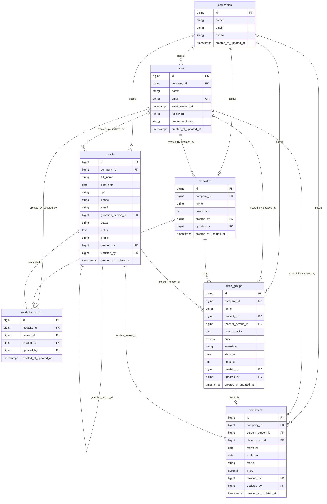

# Diagrama do banco de dados (eMatrícula)

Documento gerado a partir das migrations em `api/database/migrations`. Convenções: chaves primárias `id` bigint unsigned auto-increment, salvo indicação contrária; `timestamps()` = `created_at`, `updated_at`.

---

## Visão geral do domínio

O núcleo do negócio é **multi-tenant por empresa** (`companies`). Usuários do sistema (`users`), pessoas (`people`), modalidades, turmas e matrículas pertencem a uma empresa via `company_id`. Há também vínculos N:N entre pessoas e modalidades (`modality_person`).

---

## Diagrama ER — domínio da aplicação



### Relacionamentos e restrições (domínio)

| Origem | Destino | FK / regra |
|--------|---------|------------|
| `users` | `companies` | `company_id` → `companies.id` |
| `people` | `companies` | `company_id` → cascade on delete |
| `people` | `people` | `guardian_person_id` → null on delete |
| `people` | `users` | `created_by`, `updated_by` → null on delete |
| `modalities` | `companies` | `company_id` → cascade on delete |
| `modalities` | `users` | `created_by`, `updated_by` → null on delete |
| `modality_person` | `modalities`, `people` | cascade on delete |
| `modality_person` | `users` | audit → null on delete |
| `class_groups` | `companies`, `modalities`, `people` (professor) | cascade on delete |
| `class_groups` | `users` | audit → null on delete |
| `enrollments` | `companies`, `people` (aluno), `class_groups` | cascade on delete |
| `enrollments` | `users` | audit → null on delete |

### Unicidades

- `users.email` — único global.
- `people` — único por empresa: `(company_id, email)`, `(company_id, cpf)` (CPF pode ser nulo na coluna, conforme migration).
- `modalities` — `(company_id, name)`.
- `modality_person` — `(modality_id, person_id)`.
- `class_groups` — `(company_id, name)`.
- `enrollments` — `(company_id, class_group_id, student_person_id)` (um aluno por turma por empresa).

---

## Diagrama ER — autenticação e sessão (Laravel)

```mermaid
erDiagram
    users {
        bigint id PK
        bigint company_id FK
        string email UK
    }

    password_reset_tokens {
        string email PK
        string token
        timestamp created_at
    }

    sessions {
        string id PK
        bigint user_id FK_index
        string ip_address
        text user_agent
        longtext payload
        int last_activity_index
    }

    personal_access_tokens {
        bigint id PK
        string tokenable_type
        bigint tokenable_id_index
        text name
        string token UK
        text abilities
        timestamp last_used_at
        timestamp expires_at_index
        timestamps created_at_updated_at
    }

    users ||--o{ sessions : "opcional"
```

`password_reset_tokens` usa `email` como chave primária; **não há FK** para `users` na migration.

`personal_access_tokens` é **polimórfica** (`tokenable_type`, `tokenable_id`); não há FK para uma tabela fixa na migration.

---

## Tabelas de infraestrutura Laravel

Sem FKs de negócio entre si; usadas por cache, filas e locks.

| Tabela | Função resumida |
|--------|-----------------|
| `cache` | Chave/valor com expiração |
| `cache_locks` | Locks de cache |
| `jobs` | Filas de jobs |
| `job_batches` | Lotes de jobs |
| `failed_jobs` | Jobs falhos (`uuid` único) |

---

## Laravel Telescope (conexão configurável)

As tabelas abaixo são criadas na conexão retornada por `config('telescope.storage.database.connection')`, não necessariamente a mesma do app.

```mermaid
erDiagram
    telescope_entries {
        bigint sequence PK
        uuid uuid UK
        uuid batch_id
        string family_hash
        boolean should_display_on_index
        string type
        longtext content
        datetime created_at
    }

    telescope_entries_tags {
        uuid entry_uuid PK_FK
        string tag PK
    }

    telescope_monitoring {
        string tag PK
    }

    telescope_entries ||--o{ telescope_entries_tags : "uuid"
```

- `telescope_entries_tags.entry_uuid` → `telescope_entries.uuid` com **cascade on delete**.

---

## Ordem sugerida de leitura das migrations

1. `companies`
2. `users`, `password_reset_tokens`, `sessions`
3. `cache`, `cache_locks`
4. `jobs`, `job_batches`, `failed_jobs`
5. `personal_access_tokens`
6. `people`
7. `modalities`, `modality_person`
8. `class_groups`, `enrollments`
9. `telescope_entries`, `telescope_entries_tags`, `telescope_monitoring`

---

## Renderização dos diagramas

Arquivos Markdown com blocos `mermaid` podem ser visualizados no GitHub, GitLab, VS Code/Cursor (extensão Mermaid) ou exportados com [Mermaid Live Editor](https://mermaid.live).
